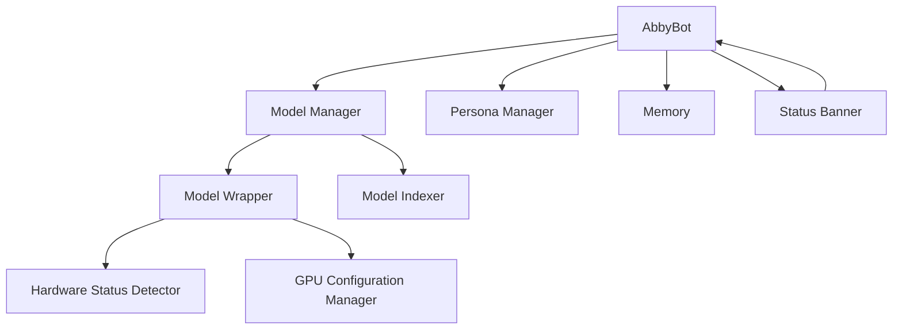

# Design Document: Enhanced Model Management

## Overview

The Enhanced Model Management feature will improve the NavyYard chatbot's model handling capabilities by providing clear visibility into the active model's status, ensuring reliable GPU acceleration, and optimizing the model switching process. This design document outlines the architecture, components, interfaces, and implementation strategy for enhancing the model management functionality while maintaining the chatbot's modular design principles.

The feature will focus on five key areas:
1. Creating a status banner system to display model and hardware information
2. Implementing pre-indexing of models for immediate command availability
3. Optimizing persona switching to avoid unnecessary model reloads
4. Enhancing the model wrapper to be aware of its hardware status
5. Ensuring reliable GPU configuration across model changes

## Architecture

The Enhanced Model Management feature will build upon the existing architecture of the NavyYard chatbot. We will modify several existing components and add new functionality to improve model management.

### High-Level Architecture



## Components and Interfaces

### 1. Status Banner Component

We will create a new component responsible for generating and displaying the status banner:

```python
class StatusBanner:
    def __init__(self, bot):
        self.bot = bot
        
    def generate_banner(self):
        # Generate the status banner based on current state
        # Include model name, hardware mode, GPU layers, and persona
        
    def display(self):
        # Display the banner with appropriate formatting
        
    def update(self):
        # Update and redisplay the banner when state changes
```

### 2. Enhanced Model Manager

We will enhance the existing `model_manager.py` to support pre-indexing of models:

```python
class ModelManager:
    def __init__(self, config):
        # Initialize model manager
        self.models = []
        self.indexed = False
        # Pre-index models at initialization
        self.index_models()
        
    def index_models(self):
        # Index available models
        # Store results for quick access
        self.indexed = True
        
    def get_model_by_index(self, index):
        # Return model by index without requiring re-indexing
        
    def load_model(self, model_path):
        # Load model and ensure GPU settings are applied
        # Verify hardware mode after loading
```

### 3. Enhanced Model Wrapper

We will enhance the `model_wrapper.py` to be aware of its hardware status:

```python
class ModelWrapper:
    def __init__(self, model_path, config):
        # Initialize model wrapper
        self.model_path = model_path
        self.config = config
        self.hardware_mode = None
        self.gpu_layers = 0
        
    def load_model(self):
        # Load model with appropriate settings
        # Detect and store hardware mode
        
    def detect_hardware_mode(self):
        # Detect if running on CPU or GPU
        # Determine number of GPU layers if applicable
        
    def get_hardware_info(self):
        # Return hardware mode and GPU layers
        
    def ensure_gpu_config(self):
        # Ensure GPU settings are applied correctly
        # Verify and log warnings if issues are detected
```

### 4. Optimized Persona Switching

We will modify the persona switching logic in `bot.py` to avoid unnecessary model reloads:

```python
def switch_persona(self, persona_name):
    # Store current model
    current_model = self.model_wrapper
    
    # Switch persona
    self.persona_manager.load_persona(persona_name)
    
    # Update prompt template without reloading model
    self.prompter.update_system_prompt(self.persona_manager.get_system_prompt())
    
    # Update status banner
    self.status_banner.update()
```

## Data Models

### Hardware Status

```python
@dataclass
class HardwareStatus:
    mode: str  # "CPU" or "GPU"
    gpu_layers: int = 0  # Number of GPU layers if in GPU mode
    cuda_available: bool = False  # Whether CUDA is available
    performance_metrics: Dict[str, Any] = field(default_factory=dict)  # Additional metrics
```

### Model Status

```python
@dataclass
class ModelStatus:
    name: str  # Model name
    path: str  # Model path
    hardware_status: HardwareStatus  # Hardware status
    loaded_at: datetime  # When the model was loaded
    parameters: Dict[str, Any]  # Model parameters
```

## Error Handling

The Enhanced Model Management feature will implement robust error handling to ensure that issues with model loading and GPU configuration are properly detected and reported:

1. If GPU acceleration fails, the system will log a warning and notify the user rather than silently falling back to CPU mode.
2. If a model cannot be loaded, the system will provide a clear error message and attempt to fall back to a previously working model.
3. If hardware detection fails, the system will assume CPU mode and log a warning.

All errors will be logged using the existing error handling system in `error_handler.py`.

## Testing Strategy

### Unit Tests

1. Test the `StatusBanner` class to ensure it generates the correct banner based on different states
2. Test the enhanced `ModelManager` class to verify pre-indexing functionality
3. Test the `ModelWrapper` class to ensure it correctly detects and reports hardware status
4. Test the optimized persona switching logic to ensure it doesn't reload models unnecessarily

### Integration Tests

1. Test the interaction between the `ModelManager`, `ModelWrapper`, and `StatusBanner` components
2. Test the end-to-end flow of model loading, hardware detection, and status banner display
3. Test persona switching with different models to ensure consistency

### Performance Tests

1. Measure the startup time with model pre-indexing enabled
2. Measure the time taken to switch personas with the optimized approach
3. Compare model loading times with and without explicit GPU configuration

## Implementation Plan

### Phase 1: Hardware Status Detection

1. Enhance the `ModelWrapper` class to detect and store hardware status
2. Implement methods to query hardware status
3. Add logging for hardware mode changes

### Phase 2: Status Banner Implementation

1. Create the `StatusBanner` class
2. Implement banner generation and display logic
3. Integrate with `AbbyBot` class

### Phase 3: Model Pre-indexing

1. Modify the `ModelManager` class to support pre-indexing
2. Ensure model commands work without requiring explicit indexing
3. Optimize indexing to minimize startup delay

### Phase 4: Reliable GPU Configuration

1. Implement explicit GPU configuration setting
2. Add verification of GPU settings after model loading
3. Implement warning system for GPU fallback

### Phase 5: Optimized Persona Switching

1. Modify persona switching logic to avoid model reloads
2. Ensure prompt templates are updated correctly
3. Update status banner after persona switches

## Security Considerations

1. The Enhanced Model Management feature will only interact with local models and system resources.
2. No external network requests will be made for model management.
3. User data will not be affected by these changes.

## Performance Considerations

1. **Model Pre-indexing**: The pre-indexing of models will be optimized to minimize startup delay.
2. **Hardware Detection**: Hardware detection will be cached to avoid repeated checks.
3. **Status Banner**: The status banner will be generated efficiently to avoid performance impact.
4. **Persona Switching**: Persona switching will be optimized to be as fast as possible.

## Future Enhancements

1. Add support for more detailed GPU metrics (memory usage, temperature, etc.)
2. Implement automatic model optimization based on detected hardware
3. Add support for mixed precision inference
4. Implement model caching to further improve loading times