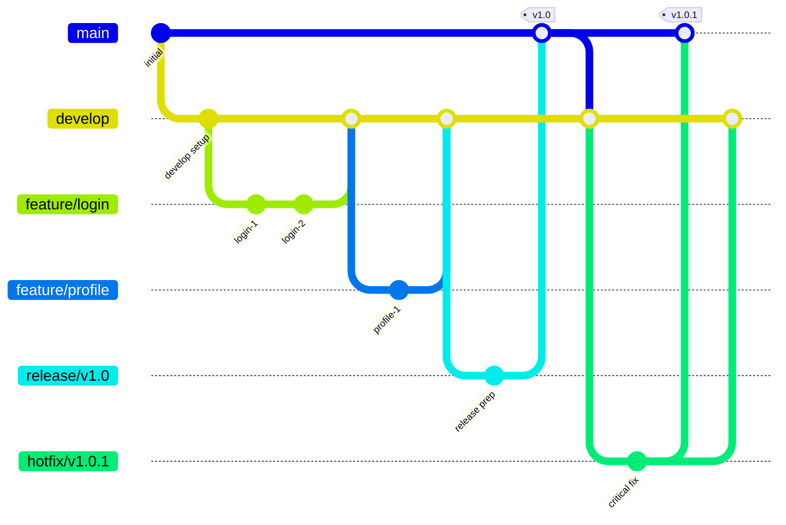
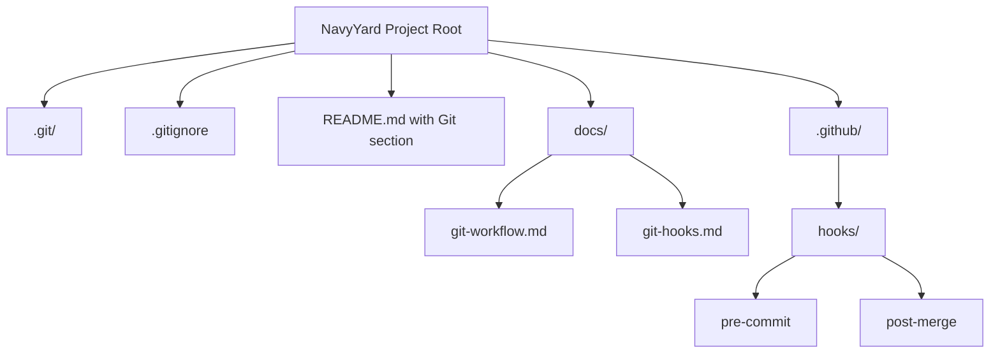

# Design Document: Git Integration

## Overview

This design document outlines the approach for implementing Git version control for the NavyYard project, integrating with a private Gitea server at git.wlkns.org. The implementation will follow industry best practices for Git workflows while accommodating the specific needs of the NavyYard project structure.

## Architecture

The Git integration will be structured around the following components:

1. **Local Repository Configuration**: Setup of the Git repository in the project root directory with appropriate configuration.
2. **Remote Repository Connection**: Configuration of the remote repository on the Gitea server.
3. **Branch Structure**: Definition of the branch architecture and workflow.
4. **Git Hooks**: Implementation of automation through Git hooks.
5. **Documentation**: Creation of comprehensive documentation for Git usage.

## Components and Interfaces

### 1. Local Repository Configuration

The local Git repository will be initialized in the project root directory with the following configuration:

- **Git Configuration**: User name, email, and other global settings
- **.gitignore**: Custom configuration to exclude:
  - Python virtual environments (.venv/)
  - Compiled Python files (__pycache__/, *.pyc)
  - Model files (optional, depending on size and distribution strategy)
  - Cache files (model_cache.json)
  - IDE-specific files (.vscode/, .idea/)
  - Temporary files and logs

### 2. Remote Repository Connection

The remote repository will be configured with:

- **Remote URL**: git.wlkns.org/[username]/navyyard.git
- **Authentication**: SSH key-based authentication for secure access
- **Initial Push**: Configuration for the initial push of the codebase

### 3. Branch Structure

The branch structure will follow the GitFlow workflow with adaptations:

```
master/main       - Stable production code
|
+-- develop       - Integration branch for features
|   |
|   +-- feature/* - Feature branches
|
+-- release/*     - Release preparation branches
|
+-- hotfix/*      - Emergency fixes for production
```

### 4. Git Hooks

Git hooks will be implemented for:

- **Pre-commit**: 
  - Code formatting (using Black for Python)
  - Linting (using flake8)
  - Basic syntax checking

- **Post-merge**:
  - Dependency checking (verify requirements.txt consistency)
  - Notification of significant changes

### 5. Documentation

Documentation will be created in the following locations:

- **README.md**: Basic Git usage section
- **docs/git-workflow.md**: Detailed workflow documentation
- **docs/git-hooks.md**: Documentation for available hooks and how to use them

## Data Models

No specific data models are required for Git integration beyond the standard Git objects (commits, trees, blobs, tags).

## Error Handling

The Git integration will include:

1. **Conflict Resolution Guidelines**: Documentation on how to handle merge conflicts
2. **Recovery Procedures**: Steps for recovering from common Git issues
3. **Backup Strategy**: Regular backup procedures for the repository

## Testing Strategy

Testing for the Git integration will include:

1. **Repository Setup Verification**: Ensure the repository is correctly initialized
2. **Remote Connection Testing**: Verify connectivity to the Gitea server
3. **Workflow Testing**: Test the branch workflow with sample feature branches
4. **Hook Testing**: Verify that Git hooks function as expected

## Diagrams

### Git Workflow Diagram



### Repository Structure



## Design Decisions and Rationales

1. **GitFlow Workflow**: Selected for its clear separation of concerns and support for parallel development. This workflow is well-suited for projects with scheduled releases like NavyYard.

2. **SSH Authentication**: Chosen over HTTPS for enhanced security and to avoid password prompts during operations.

3. **Selective .gitignore**: Carefully designed to exclude generated files while ensuring all necessary source code is tracked.

4. **Automated Hooks**: Implemented to enforce code quality standards without requiring manual intervention.

5. **Comprehensive Documentation**: Created to ensure all team members can follow the Git workflow consistently.

6. **Backup Strategy**: Implemented to prevent data loss and ensure business continuity.