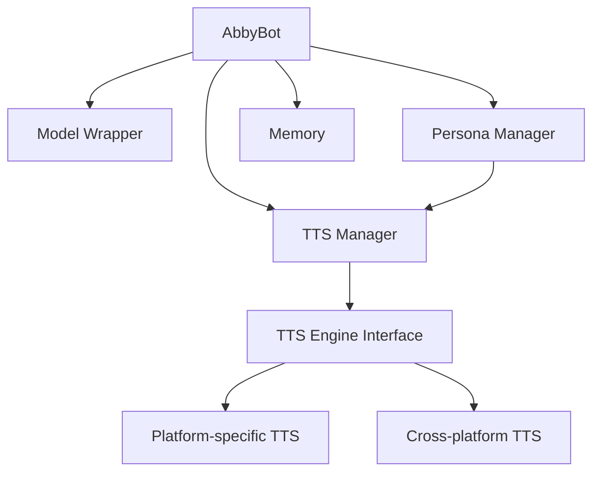

# Design Document: Text-to-Speech Feature

## Overview

The Text-to-Speech (TTS) feature will add voice output capabilities to the NavyYard chatbot. This design document outlines the architecture, components, interfaces, and implementation strategy for integrating TTS functionality into the existing chatbot system while maintaining its modular design principles.

The TTS system will convert the chatbot's text responses into spoken audio using platform-specific or cross-platform TTS engines. It will support configuration options, voice selection, and integration with the chatbot's persona system.

## Architecture

The TTS feature will follow the existing modular architecture of the NavyYard chatbot. We will create a new `tts_manager.py` module that will handle all TTS-related functionality, similar to how other managers (like `model_manager.py` and `persona_manager.py`) are structured.

### High-Level Architecture



The TTS Manager will be integrated into the main `AbbyBot` class, which will call the TTS functionality when responses are generated. The TTS Manager will handle the conversion of text to speech and manage TTS configuration.

## Components and Interfaces

### 1. TTS Manager

The `TTSManager` class will be the main entry point for TTS functionality:

```python
class TTSManager:
    def __init__(self, config):
        # Initialize TTS engine based on config
        # Load voice settings
        
    def speak(self, text, interrupt=True):
        # Convert text to speech
        # Handle interruption of previous speech if needed
        
    def toggle_tts(self, enabled=None):
        # Enable or disable TTS
        
    def set_voice(self, voice_id):
        # Set the voice to use
        
    def get_available_voices(self):
        # Return list of available voices
        
    def is_speaking(self):
        # Check if TTS is currently active
```

### 2. TTS Engine Interface

To support multiple TTS engines and ensure cross-platform compatibility, we'll create an abstract base class:

```python
class TTSEngineBase:
    def speak(self, text):
        # Abstract method to be implemented by specific engines
        pass
        
    def stop(self):
        # Stop current speech
        pass
        
    def get_voices(self):
        # Get available voices
        pass
        
    def set_voice(self, voice_id):
        # Set voice
        pass
```

### 3. Platform-specific Implementations

We'll implement concrete TTS engines for different platforms:

- `WindowsTTSEngine`: Using Windows SAPI
- `MacOSTTSEngine`: Using macOS's NSSpeechSynthesizer
- `LinuxTTSEngine`: Using speech-dispatcher or other Linux TTS systems
- `PyttsxEngine`: Using pyttsx3 as a cross-platform fallback
- `CoquiTTSEngine`: Using Coqui TTS for high-quality neural speech synthesis

### 4. Configuration Integration

The TTS settings will be integrated into the existing configuration system:

```yaml
# In settings.yaml
tts:
  enabled: true
  engine: "auto"  # auto, pyttsx3, system, coqui
  default_voice: null  # Use system default
  rate: 200  # Words per minute
  coqui:
    model_name: "tts_models/de/thorsten/tacotron2-DDC"  # Default German model
    speaker_idx: 0  # Speaker index for multi-speaker models
    vocoder: "vocoder_models/universal/libri-tts/fullband-melgan"
    use_gpu: true  # Use GPU acceleration if available
```

### 5. Persona Integration

The persona configuration will be extended to include voice settings:

```yaml
# In persona YAML files
voice:
  id: "voice_id"  # Platform-specific voice identifier
  rate: 200  # Words per minute
```

## Data Models

### TTS Configuration

```python
@dataclass
class TTSConfig:
    enabled: bool = False
    engine: str = "auto"
    default_voice: Optional[str] = None
    rate: int = 200
```

### Voice

```python
@dataclass
class Voice:
    id: str
    name: str
    gender: Optional[str] = None
    language: Optional[str] = None
```

## Error Handling

The TTS system will implement robust error handling to ensure that TTS failures don't affect the core chatbot functionality:

1. If TTS initialization fails, the system will log the error and disable TTS functionality.
2. If a specific TTS operation fails, the system will log the error and continue without speech output.
3. If a selected voice is not available, the system will fall back to the default voice and notify the user.
4. If no TTS engines are available, the system will disable TTS and notify the user.

All TTS-related errors will be logged using the existing error handling system in `error_handler.py`.

## Testing Strategy

### Unit Tests

1. Test the `TTSManager` class with mock TTS engines
2. Test platform detection and engine selection
3. Test configuration loading and validation
4. Test voice selection and fallback mechanisms

### Integration Tests

1. Test integration with the `AbbyBot` class
2. Test integration with the configuration system
3. Test integration with the persona system
4. Test command handling for TTS-related commands

### Manual Tests

1. Test actual audio output on different platforms
2. Test performance with different response lengths
3. Test interruption functionality
4. Test streaming mode compatibility

## Coqui TTS Integration

### Overview

Coqui TTS is a deep learning toolkit for Text-to-Speech that provides high-quality neural speech synthesis. It supports multiple languages and offers various pre-trained models with different speakers.

### CoquiTTSEngine Implementation

The `CoquiTTSEngine` will provide access to Coqui TTS functionality:

```python
class CoquiTTSEngine(TTSEngineBase):
    def __init__(self, model_name=None, speaker_idx=0, use_gpu=True):
        # Initialize Coqui TTS with specified model
        # Load model and vocoder
        # Set up GPU acceleration if available
        
    def speak(self, text):
        # Generate audio using Coqui TTS
        # Play audio through system audio
        
    def get_voices(self):
        # Return available speakers for the current model
        # Include model information in voice data
        
    def set_voice(self, voice_id):
        # Set speaker index or switch model if needed
        
    def get_available_models(self):
        # Return list of available Coqui TTS models
```

### Model Management

Coqui TTS supports various pre-trained models:

- **Single-speaker models**: One voice per model
- **Multi-speaker models**: Multiple speakers within one model
- **Language-specific models**: Optimized for specific languages

The system will:
1. Download models on first use (with user consent)
2. Cache models locally for faster loading
3. Provide model switching capabilities
4. Support both local and remote model loading

### Speaker Selection

For multi-speaker models, the system will:
1. Enumerate available speakers within a model
2. Allow selection by speaker index or name
3. Provide speaker preview functionality
4. Store speaker preferences per persona

### Configuration

Extended configuration for Coqui TTS:

```yaml
tts:
  coqui:
    model_name: "tts_models/de/thorsten/tacotron2-DDC"
    speaker_idx: 0
    vocoder: "vocoder_models/universal/libri-tts/fullband-melgan"
    use_gpu: true
    model_cache_dir: "models/tts"
    download_models: true  # Auto-download missing models
```

## Dependencies

The TTS feature will require the following dependencies:

- **pyttsx3**: Cross-platform TTS library (fallback option)
- **TTS**: Coqui TTS library for neural speech synthesis
- **torch**: PyTorch for neural model inference (Coqui TTS dependency)
- **Platform-specific dependencies**:
  - Windows: None (uses built-in SAPI)
  - macOS: None (uses built-in NSSpeechSynthesizer)
  - Linux: speech-dispatcher (optional)

These dependencies will be added to the `requirements.txt` file and installed by the `run.sh` script.

## Command Integration

The TTS functionality will be exposed through the following chat commands:

- `!tts on/off`: Enable or disable TTS
- `!tts voices`: List available voices
- `!tts voice <voice_id>`: Set the voice to use
- `!tts rate <rate>`: Set the speech rate
- `!tts stop`: Stop current speech

These commands will be implemented in a new module `tts_commands.py` in the `commands` directory, following the pattern established by other command modules.

## Performance Considerations

1. **Asynchronous Processing**: TTS operations will run in a separate thread to avoid blocking the main chatbot thread.
2. **Caching**: Frequently used phrases could be cached to improve performance.
3. **Chunking**: For long responses, the text will be split into chunks for more responsive TTS.
4. **Resource Management**: TTS engines will be properly initialized and terminated to avoid resource leaks.

## Security Considerations

1. The TTS feature will only process text that has been generated by the chatbot.
2. No external network requests will be made for TTS processing.
3. User data will not be sent to external services.

## Future Enhancements

1. Support for SSML (Speech Synthesis Markup Language) for more control over speech output
2. Integration with cloud-based TTS services (optional)
3. Voice customization options (pitch, rate, etc.)
4. Text preprocessing for better pronunciation of technical terms